{name}Vladimir Yunev{/name}{company}Microsoft{/company}{title}Развертывание Django на Microsoft Azure{/title}{cat}1{/cat}{date}12.04.2016{/date}{desc}Развертывание Django на Microsoft Azure{/desc}

Разработчики, которые создают решения в стеке Django могут легко
размещать свои решения в облачной платформе Microsoft Azure. Проще всего
это сделать с помощью виртуальных машин.

Для упрощения работы с виртуальными машинами в облаке Azure предлагается
площадка Azure Marketplace, в которой находятся сотни заранее
настроенных виртуальных машин с разным окружением и установленными
инструментами, включая операционные системы, базы данных, среды,
фреймворки, CMS и так далее.

Рассмотрим, как любой пользователь Azure может развернуть стек Django за
несколько минут.

Поиск Django в Azure Marketplace
================================

> *Подразумевается, что у вас уже есть учетная запись Microsoft Azure.
> Если это не так, то воспользуйтесь бесплатным [триал-предложением по
> этой ссылке](https://azure.microsoft.com/ru-ru/free/).*

Перейдите на портал Microsoft Azure по ссылке <http://portal.azure.com>,
вы откроете панель управления облачными мощностями Microsoft Azure,
предоставленными вам по запросу (рисунок 1).

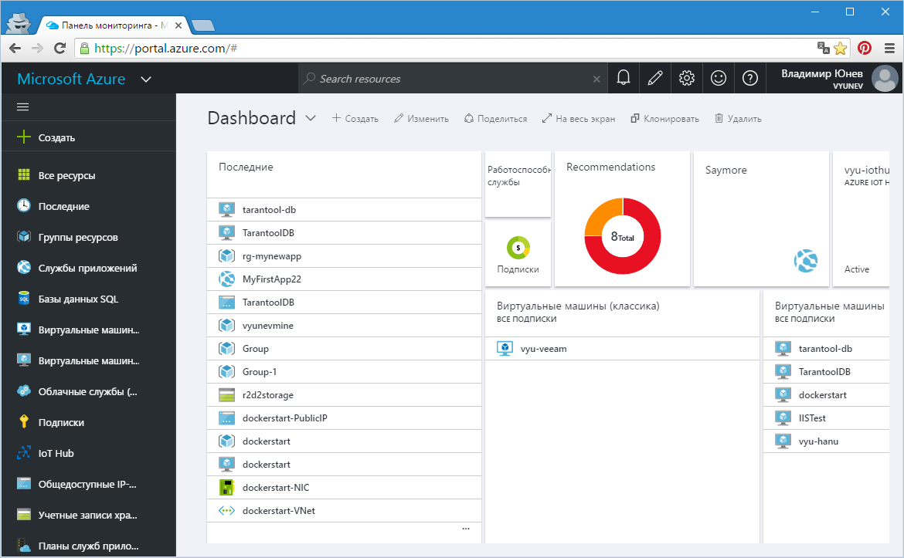

*Рис.1 – Портал Microsoft Azure*

Нажмите на кнопку «Создать» для добавления нового компонента в свою
учетную запись. В нашем случае мы намереваемся добавить виртуальную
машину со стеком Django. Введите в строку поиска Django. Вы получите
полный список доступных в Azure Marketplace конфигураций Django на выбор
(рисунок 2).

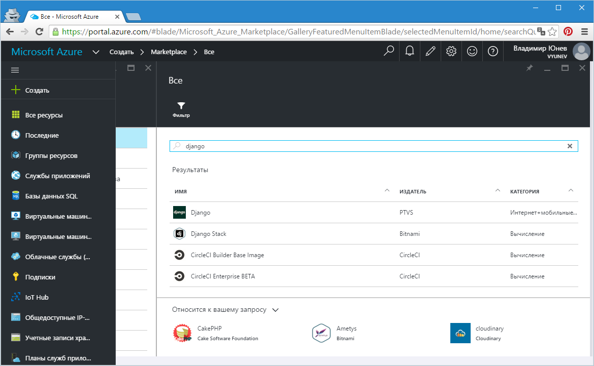

*Рис.2. – Список Django в Azure Marketplace*

Выберите Django Stack и в новом информационном окне нажмите кнопку
«Создать». Теперь вы перейдете к непосредственному созданию виртуальной
машины, выбранной из Azure Marketplace (рисунок 3).

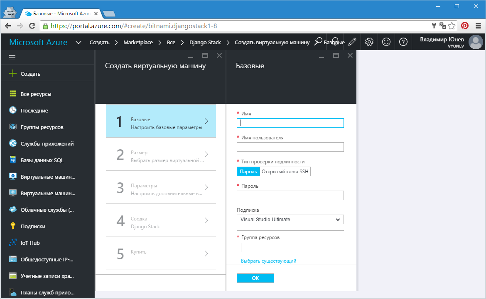

*Рис.3. – Создание виртуальной машины*

Создание VM с Django
====================

Чтобы создать виртуальную машину, в нашем случае с Django на борту,
необходимо указать ряд параметров. В первую очередь ввести название
виртуальной машины. Затем имя пользователя (администратора) и пароль
доступа. Выбрать подписку Azure, если у вас их несколько.

Важный параметр, который необходимо указать – это группа ресурсов. В
целом, группа ресурсов – это просто объединение разных облачных ресурсов
– VM, хранилища, сетей – под одним именем для упрощения
администрирования. Поэтому, на данном этапе просто введите название для
группы.

Последний параметр, который нужно указать на первом шаге – расположение
виртуальной машины – по существу выбор одного из ЦОД Microsoft Azure,
которые расположены по всему миру. Ближайшие к России ЦОД – это Северная
или Западная Европа. Выберите один из них.

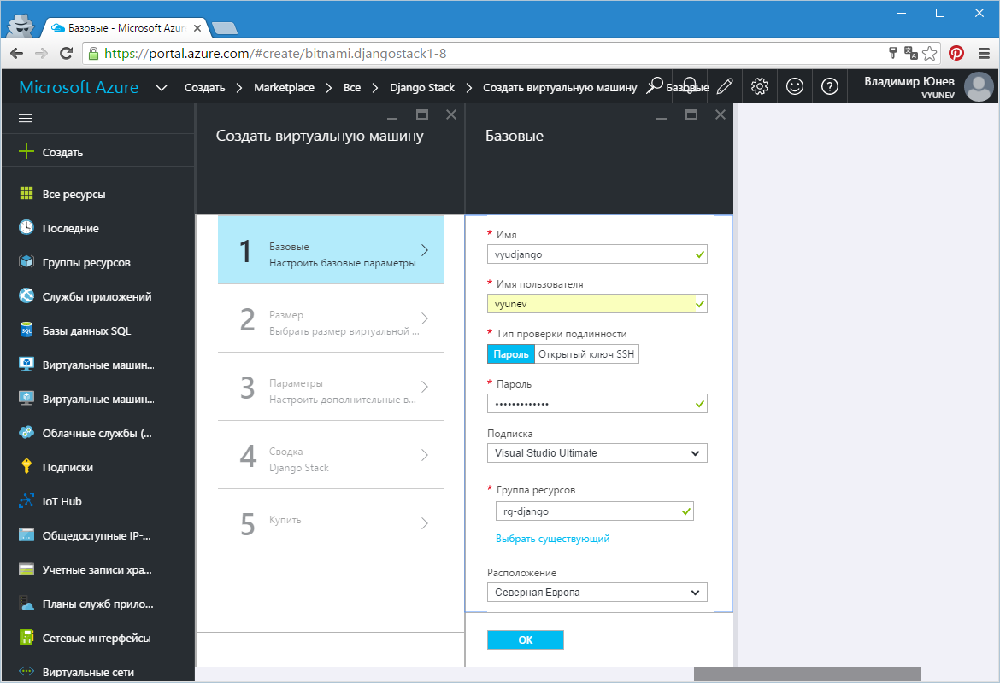

*Рис.4. – Параметры первого шага создания виртуальной машины*

Нажмите «ОК» после ввода всех параметров. На втором шаге вам предложат
выбрать размер виртуальный машины. По умолчанию будут представлены
несколько типов машин, которые рекомендуются для данного типа решения.
Но вы всегда можете выбрать другой размер нажав на «Просмотреть все»
(рисунок 4).

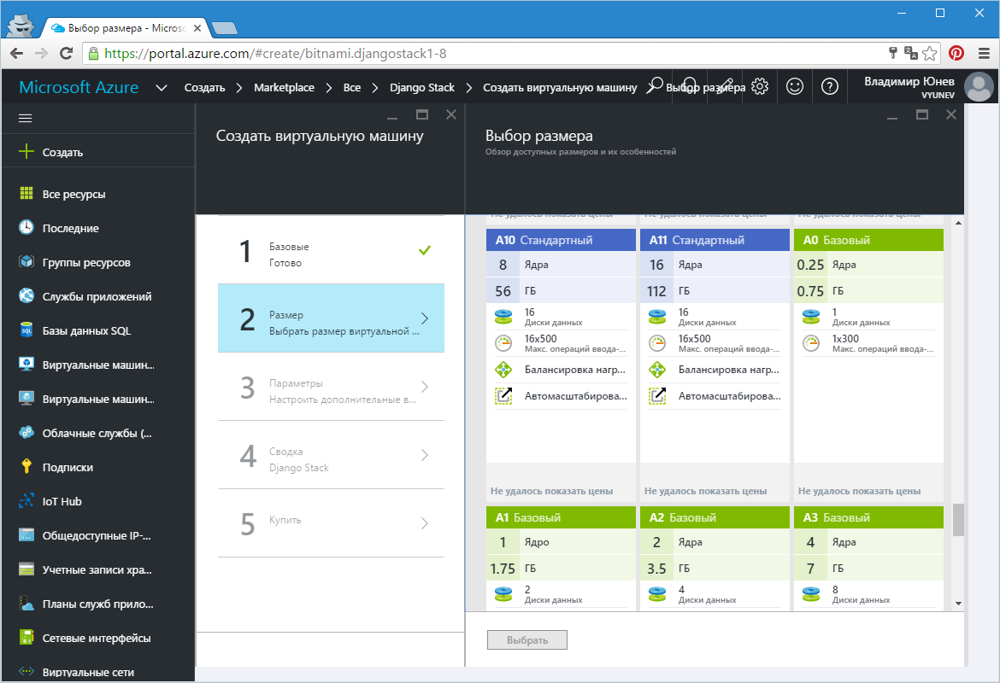

*Рис.4. – Выбор размера виртуальной машины*

Я предлагаю выбрать вам размер «A1 Базовый» как подходящий для
тестирования. После выбора нажмите кнопку «Выбрать», чтобы перейти к
третьему шагу.

На третьем шаге производится тонкая настройка развертывания. Здесь все
параметры можно оставить по умолчанию и вообще ничего не менять. Но если
требуется, что вы можете выбрать SSD-хранилище для VM, настроить
виртуальную сеть, безопасность, включить мониторинг, создать группу
доступности для отказоустойчивой работы VM (рисунок 5).

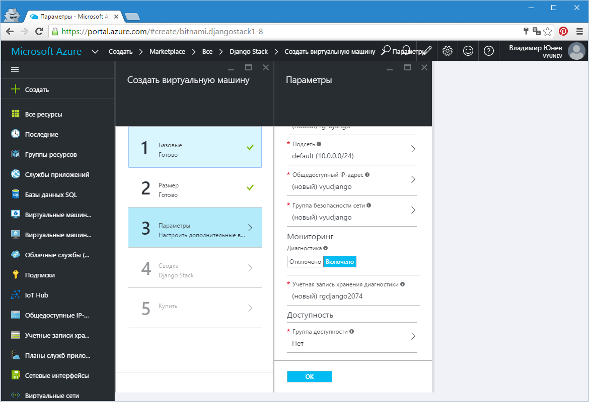

*Рис.5. – Тонкие настройки развертывания VM*

Нажмите «ОК» после тонкой настройки для того, чтобы перейти к финальным
шагам и запуску виртуальной машины.

Вы получите информационное окно с перечислением ваших настроек (рисунок
6).

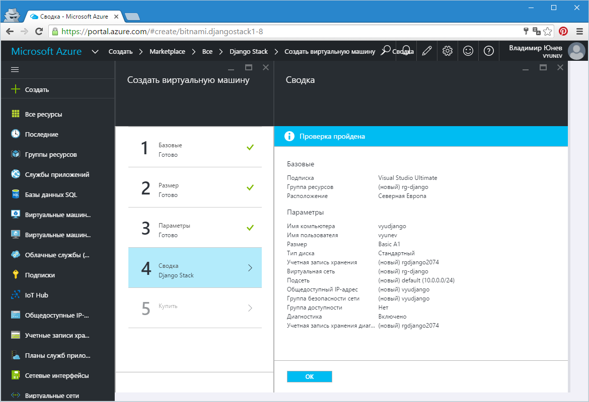

*Рис.6. – Информационное окно с настройками*

Ознакомьтесь с информацией и нажмите «ОК» для того чтобы перейти к
приобретению виртуальной машины для своей подписки.

> ***Для информации.** Приобретение в данном случае означает создание VM
> с бесплатным ПО на нем. В Azure Marketplace есть продукты, которые
> могут потребовать приобретения лицензии на них.*

Прочитайте информацию о приобретении (рисунок 7). В нашем случае
содержание виртуальной машины стоит 0 рублей. Стоимость выбранной нами
самой VM, которую предоставить Microsoft Azure – около 3 р. в час.

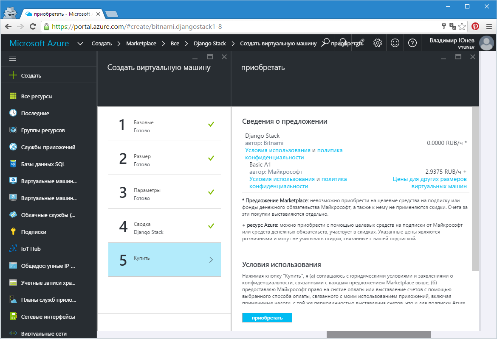

*Рис.7. – Приобретение виртуальной машины*

Нажмите кнопку «Приобретение» для того чтобы запустить процесс
развертывания вашей виртуальной машины с Django на борту.

Вы увидите информационное сообщение «Развертывание начато…» (рисунок 8).

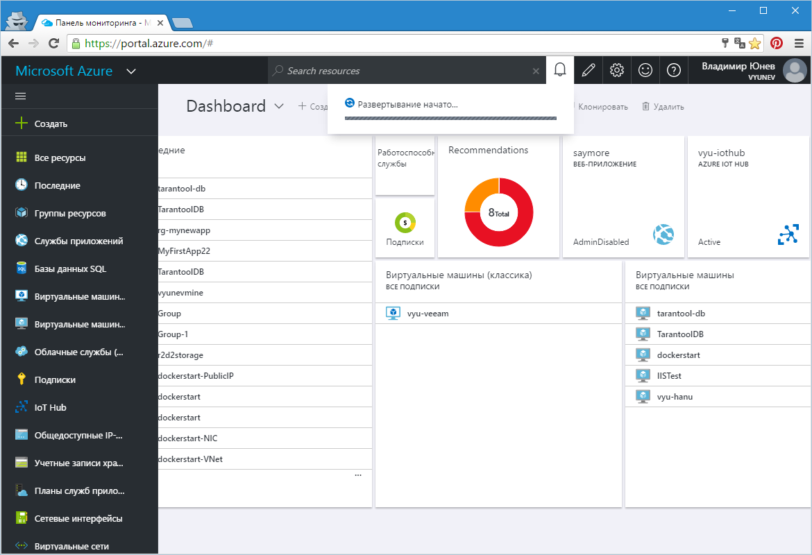

*Рис.8. – Развертывание начато*

Как только VM будет готова вы получите еще одно информационное
сообщение, а на портале откроется панель управления созданной VM
(рисунок 9). В общем случае, создание виртуальной машины занимает
несколько минут.

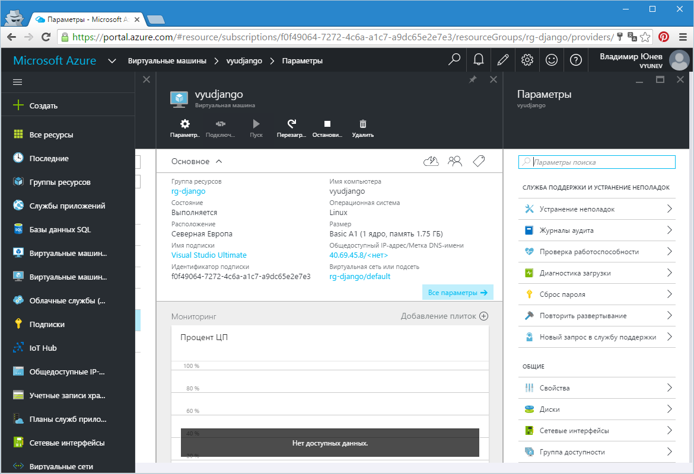

*Рис.9. – Панель управления виртуальной машиной*

Поздравляю! Вы развернули свою машину с готовым стеком Django.

Управление развернутой виртуальной машиной
==========================================

Для того чтобы убедиться в работоспособности виртуальной машины первым
делом мы можем перейти по ее общедоступному адресу.

Вы можете найти общедоступный адрес в заголовке панели
администрирования. В моем случае это <http://40.69.45.8/>. Перейдя по
этому адресу, мы увидим стандартное приветствие (рисунок 10).

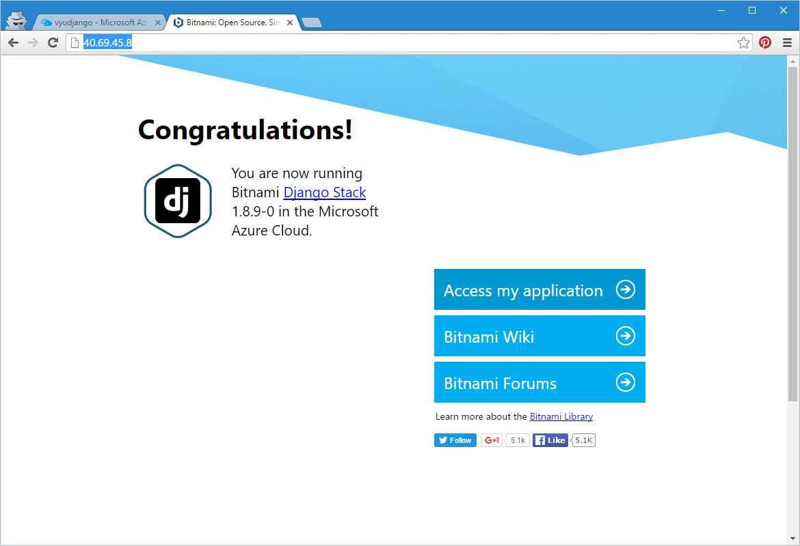

*Рис.10 – Стандартное приветствие от запущенной в Azure машины с Django*

Данная виртуальная машина была подготовлена компанией Bitnami –
известным сборщиком готовых окружений. Чтобы увидеть собственно
Django-приложение вы можете нажать на «Access my application» (рисунок
11).

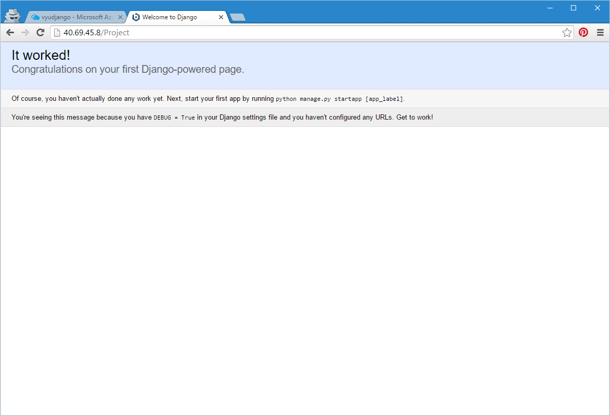

*Рис.11. – Запущенное приложение Django*

Вам может быть интересно то, как получить FQDN-адрес для своей машины в
виде доменного имени. По умолчанию для VM адрес не сопоставляется, но
его можно легко получить. Для этого перейдите в настройки VM (Все
параметры) на панели конфигурации. Затем выберите пункт «Конфигурация» и
в панели настройки укажите наименование для вашей VM, которое будет
включено в FDQN-путь (рисунок 12).

После сохранения настроек вы сможете перейти по ссылке, которая будет
представлена в виде (мой случай)
<http://vyudjango.northeurope.cloudapp.azure.com/>.

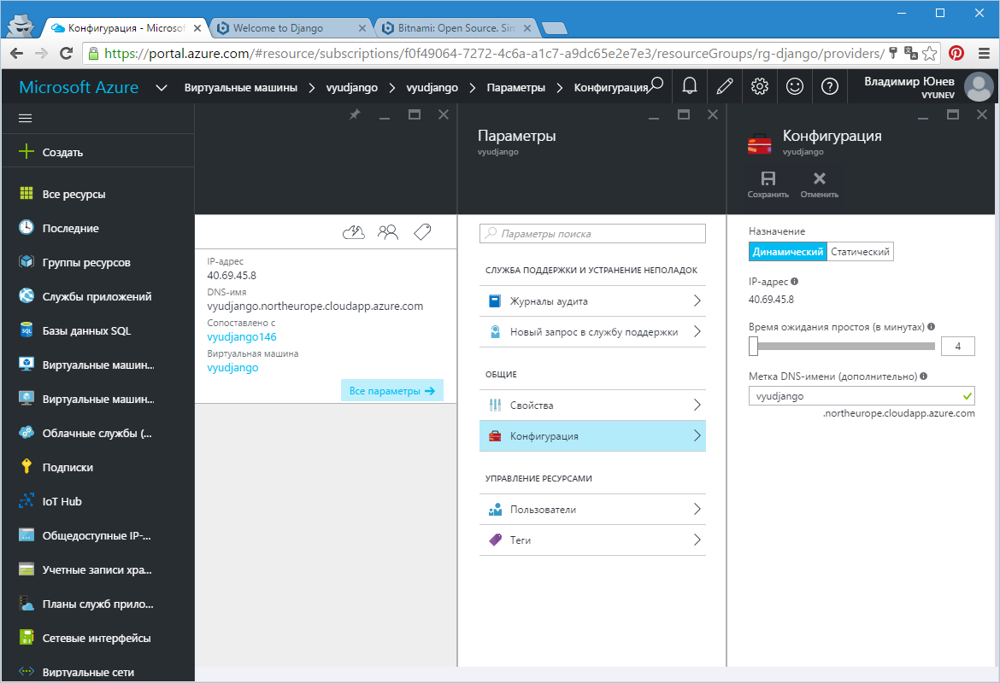

*Рис.12. – Добавление FDQN-пути для виртуальной машины*

Этот же адрес вы теперь сможете использовать для доступа по SSH к вашей
виртуальной машине (рисунок 13), например:

*SSH vyunev@vyudjango.northeurope.cloudapp.azure.com*

где vyunev – имя пользователя (администратора), которое вы указали при
создании VM.

Или просто используя адрес в любимом инструменте (рисунок 13).

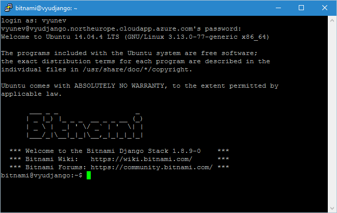

*Рис.13. – Подключение к виртуальной машине по SSH*

Теперь вы можете настроить вашу VM с Django так как душа пожелает!

Заключение
==========

Мы рассмотрели простой пример того, как с помощью Azure и площадки Azure
Marketplace за считанные минуты можно развернуть окружение Django и
получить доступ к готовой рабочей виртуальной машине.

Azure и Azure Marketplace предлагают запустить любые решения построенные
на любой технологии, в том числе для Linux и Windows. Вот лишь краткий
список того, что вы можете найти: Red Hat Enterprise Linux, Oracle
Linux, CentOS, CoreOS, Ubuntu, Suse, WordPress, Moodle, MEAN, Jboss,
Redmine, SEO Panel, Parse, Git, GitLab, Django, ModX, Memcached, LAMP
Stack, Jenkins, Node.js, SugarCRM, Ruby Stack, Ghost, Subversion,
ActiveMQ, Nginx Stack, Solr, Tomcat, JRuby, OwnCloud, MySQL, Drupal,
MongoDB, Piwik, Dolibarr, LAAP Stack, OpenProject, Plone, eXo, Mahara,
Zurmo, RoundCube, Mautic, ThinkUp, Prestashop, Tracks, phpBB, eZ
Publish, Joomla…

Продолжайте использовать Azure и размещать в облаке свои
opensource-решения. Поможет вам в этом подробный раздел с документацией
и ресурсами [по этой
ссылке](https://azure.microsoft.com/ru-ru/documentation/services/virtual-machines/linux/).
