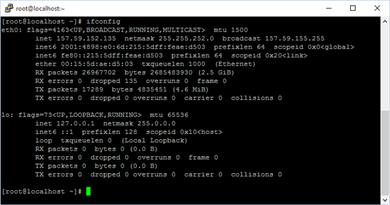
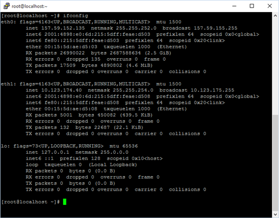
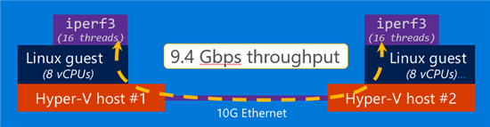

{name}Alex Belotserkovskiy{/name}{company}Microsoft{/company}{title}Microsoft Loves Linux, часть 5: Сетевой стек и функциональность Linux{/title}{cat}0{/cat}{date}12.04.2016{/date}{desc}Сетевой стек и функциональность Linux на Hyper-V{/desc}

**Производительность сети в Linux**

Высокая производительность сети - аспект, критичный для продакшна в
виртуальной среде. Цель реализации Microsoft поддержки Linux в
виртуальных машинах - достичь уровня производительности, аналогичного
невиртуальной среде (без гипервизора). Например, если физически сеть
представляет собой 10G Ethernet, то ВМ на Linux должна предоставлять
примерно те же 10 Gbps.

Так как Microsoft ориентируются на продакшн на Linux в датацентре или
Azure, типичная ВМ представляется имеющей несколько vCPU и работает на
физическом оборудовании с несколькими сокетами и ядрами. Характер
использования сети - много подключений к процессам, работающим внутри
ВМ. При этом, несмотря на то, что латентность одного сетевого пакета
важна, еще более важно обеспечить хорошую производительность в целом.
То, что было сделано Microsoft для сетевого стека Linux, и среды, в
которых это тестировалось, соответствуют описанному характеру. Дальше мы
посмотрим на детали.  

**Функциональность**

Драйвера Linux Integration Services имеют реализацию нескольких функций,
улучшающих производительность и пропускную способность - например,
Virtual Receive Side Scaling (vRSS) и некоторые TCP/IP offloads.

vRSS улучшает производительность сети за счет использования нескольких
vCPU для обработки входящих пакетов - если же она отсутствует, эти
пакеты всегда вызывают прерывания vCPU 0. При высокой нагрузке на сеть,
использование vCPU 0 может достичь 100% и стать "бутылочным горлышком"
системы даже при условии свободных ресурсов. vRSS распределяет
"прерывания" по нескольким vCPU, в результате чего достигается большая
пропускная способность сети. Замеры показали, что сетевая пропускная
способность увеличивается (с тестированием до 8 vCPU). Если же ВМ имеет
больше 8-ми vCPU, vRSS использует только 8 из них. Если ВМ имеет только
один vCPU, эффект от использования vRSS отсутствует. Аналогично
технология работает для исходящих пакетов.

"TCP large send offload" собирает несколько исходящих сетевых пакетов в
один большой Ethernet-фрейм, который может быть больше стандартного
Ethernet MTU. Этот фрейм передается на хост Hyper-V с помощью
виртуального драйвера NIC в Linux. Хост затем использует оборудования
(физический NIC) для сегментирования большого фрейма и передачи на
физический Ethernet. Если физический NIC не поддерживает такую
функциональность, Hyper-V выполняет сегментацию программно. В любом
случае, передача одного большого пакета с гостя Linux на хост более
эффективна передачи нескольких маленьких.

"Checksum offload" работает аналогично. Исходящий сетевой пакет без
чексуммы передается на хост с помощью виртуального драйвера NIC, после
чего хост использует физический NIC для расчета чексуммы, снижая
нагрузку на CPU. Если NIC такую функциональность не поддерживает, расчет
чексуммы происходит программно. В этом случае, реальный эффект
отсутствует, так как стоимость расчета чексуммы одинакова вне
зависимости, происходит он на госте или на хосте.

Эти функции работают незаметно для приложений и обычно не требуют
управления или настроек, увеличивая сетевую производительность и
сокращая нагрузку на CPU от операций передачи по сети.

**Доступность сети в Linux **

Еще одна новая функция, доступная с Windows Server 2016 Hyper-V и
последними версиями LIS (4.0 и позже) - горячее добавление и удаление
виртуальных NIC. С помощью нее можно добавлять или удалять виртуальный
NIC к ВМ в то время, когда она работает. Особенно функция может быть
полезна при отладки проблем с сетью - например, можно с помощью нового
адаптера подключиться к ВМ, если уже существующее подключение по
какой-то причине оборвалось.

Пример - есть ВМ с Linux, работающая на Hyper-V с одним vNIC. Ее вывод
ifconfig:

> * *
>
> 

Одно сетевое подключение на eth0 и одно Loopback.

Если добавить в Hyper-V Manager еще один vNIC (в Settings ВМ), ВМ
уведомит новый vNIC, создаст eth1 и назначит на него IP-адрес, используя
DHCP. Обновленный вывод ifconfig :

> 

Аналогично, при удалении vNIC соответствующий eth практически сразу
исчезнет из системы, оборвав все подключения.

**Производительность сети в Linux**

Мы измеряем сетевую пропускную способность, отправляя данные между двумя
ВМ с Linux на разных хостах Hyper-V. Хосты соединены физическим Ethernet
(10G либо 40G). Каждая ВМ имеет восемь vCPU (чтобы использовать vRSS).
На каждом госте для эмуляции нагрузки на сеть и измерения пропускной
способности используется iperf3 (open source проект, доступный на
[*GitHub*](https://github.com/esnet/iperf)).  Мы используем iperf3 с
настройкой в 16 потоков для того, чтобы сэмулировать типичный характер
нагрузки на сервер.

 

> 

Мы видим максимум пропускной способности в 9.4 Gbps, что близко к
физическому подключения по Ethernet с 10G. В сравнении с 40G, в ВМ мы
получаем максимум в около 30 Gbps. Это значение не близко к физическому
подключению, поэтому мы продолжаем работать над его улучшением.

**Резюме**

Высокая производительность и пропускная способность сети - ключевое
требование для виртуализированых сред. Linux на Hyper-V уже достиг
показателей, сравнимых с физической сетью в 10G, и продолжает улучшаться
для того, чтобы соответствовать 40G. Функции типа горячего добавления и
удаления vNIC дают нужную для расширения и перенастройки сетей гибкость
без необходимости выключения или перезапуска ВМ.

В следующей части мы расскажем про FreeBSD на Hyper-V.

From
&lt;[*http://blogs.technet.com/b/server-cloud/archive/2015/10/13/microsoft-loves-linux-deep-dive-4-linux-network-features-and-performance.aspx*](http://blogs.technet.com/b/server-cloud/archive/2015/10/13/microsoft-loves-linux-deep-dive-4-linux-network-features-and-performance.aspx)&gt;
